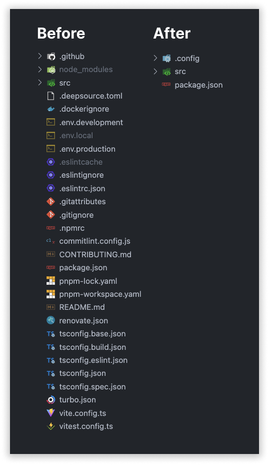

# Hidden Heaven

## Have you ever dreamed about this?



# How?

We simply put all the config files (or any file, really) into a folder. Then we symlink them all to the root, and hide them from the interface.

This also works in a nested folder structure. Everywhere you have the folder with the name `.config` (customizable), we will hide all the files in it.

This hiding part only works automatically for VSCode right now, but there is a custom hook for you to write your own hiding algorithm.

# Usage

1. Create a folder called .config in the root.
2. Move all the files or folders you want to hide into this folder.
3. Run the `npx hidden-heaven` command.
4. Now all your files are symlinked to the root

## Pure usage

```bash
npx hidden-heaven
```

## Custom source folder name

```bash
npx hidden-heaven --source-folder-name='.files'
```

## "Side effects"

- If a .gitignore exists in the root, the symlinks will be added to this list in order to not commit multiple files.
- If a .vscode/settings.json exists in the root, we will add all the symlinked files to the "files.exclude" list - which hides them from the tree interface.

## Config

You can already now do a bunch of customizations to the logic, but this is not documented yet.

# TODO

- Reverse the link direction
- Write to user settings in order to overwrite the hidings.
    - Add local ignored file to fix this? .hide.local.js?
- Add different ways of determining included files
    - Regex object
    - JS-function (in config-file)
- "init" command that move all files to .config and then syncs.
- Automatic tests
    - hide
    - clean
    - reset
    - init
- Better docs
- Add linting

# Limitations

- Windows is not yet supported, will add on demand.
- Items are ignored and hidden on root level.
    - If you want to hide them at a specific position or level, you need to write a custom hook.
